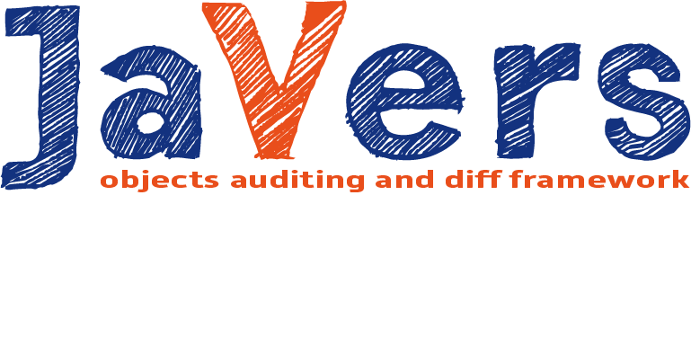




## What is JaVers
JaVers is a lightweight java library for **auditing** changes in your data.

We all use Version Control Systems for source code,
why not to use specialized framework to provide an audit trail of your Java objects (entities, POJO, data objects)?

## Check our site
You can find latest information about JaVers project at <a href="http://javers.org">javers.org</a>.
Check our 
<a href="http://javers.org/documentation">documentation</a> pages.

## Project Team
Check our site to find <a href="http://javers.org/#team">the team</a> and contact us.

## CI status
[](https://travis-ci.org/javers/javers)

## License
JaVers is licensed under Apache License Version 2.0, see LICENSE file.


# Getting started

## 1. Add javers-core to your project dependencies
For maven: 

```xml
<dependency>
    <groupId>org.javers</groupId>
    <artifactId>javers-core</artifactId>
    <version>0.8.0</version>
</dependency>
```

For gradle: 
```
compile 'org.javers:javers-core:0.8.0'
```
    
If you are going to use JaVers as object diff tool, this is only dependency you need.
        
## 2. Add javers repository to your project dependencies
If you are going to use JaVers as data audit framework, choose proper repository implementation.
For example, if you are using MongoDb add:

For maven: 
```xml
<dependency>
    <groupId>org.javers</groupId>
    <artifactId>javers-persistence-mongo</artifactId>
    <version>0.8.0</version>
</dependency>
```
For gradle: 
```
compile 'org.javers:javers-persistence-mongo:0.8.0'
```
## 3. Create JaVers instance:

Use JaversBuilder to create JaVers instance:
```java
import org.javers.core.Javers;
import org.javers.core.JaversBuilder;
//...
Javers javers = JaversBuilder.javers().build();
```
Now, JaVers instance is up & ready, configured with reasonable defaults. 
Good enough to start.

Later on, you would probably need to refine the configuration (//TODO link to Configuration), 
introducing to JaVers some basic facts about your domain model.

## Configuration

##1. Choose mapping style
There are two mapping styles in JaVers:

* <code>FIELD</code>, used by **default** and recommended in most cases, 
* <code>BEAN</code>, useful for domain models compliant with <code>Java Bean</code> convention.
 
When using <code>FIELD</code> style, JaVers is accessing objects state directly from fields.
In this case, <code>@Id</code> annotation should be placed at field level. For example:

```java
public class User {
    @Id
    private String login;
    private String name;
    //...
}
```

When using <code>BEAN</code> style, JaVers is accessing objects state by calling **getters**, annotations should be placed at method level. 
For example:

```java
public class User {
    @Id
    public String getLogin(){
        //...
    }
    
    public String getName(){
        //...
    }
    //...
}
```

<code>BEAN</code> mapping style is selected in <code>JaversBuilder</code> as follows:
```java
Javers javers = JaversBuilder
               .javers()
               .withMappingStyle(MappingStyle.BEAN)
               .build();
```

In both styles, access modifiers are not important, it could be private ;)

##2. Domain model mapping

###Why domain model mapping?
Many frameworks which deal with user domain model (aka data model) use some kind of <b>mapping</b>.
For example JPA uses annotations in order to map user classes into relational database.
Plenty of XML and JSON serializers uses various approaches to mapping, usually based on annotations.

When combined together, all of those framework-specific annotations could be a pain and
pollution in Your business domain code.

Mapping is also a case in JaVers but don't worry:
* It's far more simple than JPA
* JaVers uses reasonable defaults and takes advantage of type inferring algorithm.
  So for a quick start just let it do the mapping for You.
  Later on, it would be advisable to refine the mapping in order to optimize a diff semantic
* We believe that domain model classes should be framework agnostic,
  so we do not ask You to embrace another annotation set

JaVers wants to know only a few basic facts about your domain model classes,
particularly <a href="http://javers.org/javadoc_0.8.0/index.html?org/javers/core/metamodel/type/JaversType.html"><code>JaversType</code></a> 
of each class spotted in runtime.
**Proper mapping is essential** for diff algorithm, for example we need to know if objects of given class
should be compared property-by-property or using equals().

### Javers Types
We use *Entity* and *ValueObjects* notions following Eric Evans
Domain Driven Design terminology (DDD).
Furthermore, we use *Values*, *Primitives* and *Containers*.
The last two types are JaVers internals and can't be mapped by user.

To make long story short, You as a user are asked to label your domain model classes as
Entities, ValueObjects or Values.

Do achieve this, use <a href="http://javers.org/javadoc_0.8.0/index.html?org/javers/core/JaversBuilder.html"><code>JaversBuilder</code></a> methods:
* <a href="http://javers.org/javadoc_0.8.0/org/javers/core/JaversBuilder.html#registerEntity-java.lang.Class-"<code>JaversBuilder.registerEntity()</code></a>
* <a href="http://javers.org/javadoc_0.8.0/org/javers/core/JaversBuilder.html#registerValueObject-java.lang.Class-"<code>JaversBuilder.registerValueObject()</code></a>
* <a href="http://javers.org/javadoc_0.8.0/org/javers/core/JaversBuilder.html#registerValue-java.lang.Class-"<code>JaversBuilder.registerValue()</code></a>

Let's examine these three fundamental types more closely.

### Entity
JaVers <a href="http://javers.org/javadoc_0.8.0/index.html?org/javers/core/metamodel/type/EntityType.html"><code>Entity</code></a>
has exactly the same semantic like DDD Entity or JPA Entity.

Usually, each entity instance represents concrete physical object.
Entity has a list of mutable properties and its own *identity* hold in *id property*.
Entity can contain ValueObjects, References (to entity instances), Containers, Values & Primitives.

For example Entities are: Person, Company.

### Value Object
JaVers <a href="http://javers.org/javadoc_0.8.0/index.html?org/javers/core/metamodel/type/ValueObjectType.html"><code>ValueObject</code></a>
is similar to DDD ValueObject and JPA Embeddable.
It's a complex value holder with a list of mutable properties but without unique identifier.

In strict DDD approach, ValueObjects can't exists independently and have to be bound do Entity instances
(as a part of an Aggregate). JaVers is not such radical and supports both embedded and dangling ValueObjects.
So in JaVers, ValueObject is just Entity without identity.

For example ValueObjects are: Address, Point.

### Value
JaVers <a href="http://javers.org/javadoc_0.8.0/index.html?org/javers/core/metamodel/type/ValueType.html"><code>Value</code></a> is a simple (scalar) value holder.
Two Values are compared using **equals()** method so its highly important to implement it properly by comparing underlying state.

For example Values are: BigDecimal, LocalDate.

For Values it's advisable to customize JSON serialization by implementing *Type Adapters*,
see <a href="http://javers.org/javadoc_0.8.0/index.html?org/javers/core/json/JsonConverter.html"><code>JsonConverter</code></a>.

### TypeMapper and type inferring policy
JaVers use lazy approach to type mapping so types are resolved only for classes spotted in runtime.

To show You how it works, assume that JaVers is calculating diff on two graphs of objects
and currently two Person.class instances are compared.

ObjectGraphBuilder asks TypeMapper about JaversType of Person.class. TypeMapper does the following:

* If Person.class was spotted before in the graphs, TypeMapper has exact mapping for it and just returns already known JaversType
* If this is a first question about Person.class, TypeMapper checks if it was registered in JaversBuilder
  as one of Entity, ValueObject or Value. If so, answer is easy
* Then TypeMapper tries to find so called *Prototype&mdash;nearest* class or interface that is already mapped and is assignable from Person.class.
  So as You can see, it's easy to map whole bunch of classes with a common superclass or interface with one call to JaversBuilder.
  Just register high level concepts (classes or interfaces at the top of the inheritance hierarchy)
* When Prototype is not found, JaVers tries to infer Type by looking for <code>@Id</code> annotations at property level
  (only the annotation class name is important, package is not checked, 
  so you can use well known javax.persistence.Id or custom annotation).
  If @Id is found, class would be mapped as an Entity, otherwise as a ValueObject.

Tu summarize, when JaVers knows nothing about your class, it will be mapped as ValueObject.

So your task is to identify Entities and ValueObjects and Values in your domain model.
Try to distinct them by high level abstract classes or interfaces.
Minimize JaversBuilder configuration by taking advantage of type inferring policy.
For Values, remember about implementing equals() properly
and consider implementing JSON type adapters.
  
##3. Repository setup
If you are going to use JaVers as data audit framework you are supposed to configure JaversRepository.
 
JaversRepository is simply a class which purpose is to store Javers Commits in your database,
alongside with your domain data. 

JaVers comes by default with in-memory repository implementation. It's perfect for testing but
for production enviroment you will need something real.

First, choose proper JaversRepository implementation.
If you are using <code>MongoDB</code>, choose <code>org.javers.repository.mongo.MongoRepository</code>.
(Support for <code>SQL</code> databases, is scheduled for releasing with JaVers 1.1)
 
The idea of configuring the JaversRepository is simple, 
just provide working database connection. 

For <code>MongoDB</code>:

        Db database = ... //autowired or configured here,
                          //preferably, use the same database connection as you are using for your main (domain) database 
        MongoRepository mongoRepo =  new MongoRepository(database)
        JaversBuilder.javers().registerJaversRepository(mongoRepo).build()


## Using Object Diff
##1. Find diff between two graphs of objects

###1.1. Compare Entities

To find diff between two entities you don't have to register entity class in Javers building process. In 1.0 version was developed 
automatically discover type of object. If Javers find @Id annotation in proper place then it will be recognize as Entity, in other way it 
will be recognized as ValueObject.

The object has to be the same class and has to be object of custom class (you can't compare standard Java objects)

    private static class User {

        @Id
        private int id;
        private String name;

        public User(int id, String name) {
            this.id = id;
            this.name = name;
        }

        public int getId() {
            return id;
        }

        public String getName() {
            return name;
        }
    }

    public static void main(String[] args) {
        Javers javers = JaversBuilder
                            .javers()
                            .registerEntities(User.class)
                            .build();

        User johny = new User(25, "Johny");
        User tommy = new User(25, "Tommy");

        Diff diff = javers.compare(johny, tommy);
        List<Change> changes = diff.getChanges();
        ValueChange change = (ValueChange) changes.get(0);

        System.out.println("Changes size: " + changes.size());
        System.out.println("Entity id: " + change.getAffectedCdoId().getCdoId());
        System.out.println("Property changed: "  + change.getProperty());
        System.out.println("Property value before changed: " + change.getLeft());
        System.out.println("Property value after changed: "  + change.getRight());
    }

Output of running this program is:

        Changes size: 1
        Entity id: 25
        Property: User.name
        Property value before change: Johny
        Property value after change: Tommy

###1.1. Compare Value Object

If you don't put @Id annotation in the class definition Javers recognize object as Value Object. Javers compare property by property and 
returns <code>ValueObject</code> changes:

     public static void main(String[] args) {
        Javers javers = JaversBuilder
                            .javers()
                            .build();

        User johny = new User(25, "Johny");
        User tommy = new User(26, "Charlie");

        Diff diff = javers.compare(johny, tommy);
        List<Change> changes = diff.getChanges();
        ValueChange change1 = (ValueChange) changes.get(0);
        ValueChange change2 = (ValueChange) changes.get(1);

        System.out.println("Changes size: " + changes.size());
        System.out.println("Changed property: " + change1.getProperty());
        System.out.println("Value before change: " + change1.getLeft());
        System.out.println("Value after change: " + change1.getRight());
        System.out.println("Changed property: " + change2.getProperty());
        System.out.println("Value before change: " + change2.getLeft());
        System.out.println("Value after change: " + change2.getRight());
    }

Output:

        Changes size: 2
        Changed property: User.id
        Value before change: 25
        Value after change: 26
        Changed property: User.name
        Value before change: Johny
        Value after change: Charlie
        
## Using Data Auditing Framework

##1. Persist Snapshots
        
###1.1 Create and register Javers MongoDB repository
 
To persist your changes in database firstly you have to add dependency to javers-persistence-mongo module:
 
maven:
    <code><dependency>
              <groupId>org.javers</groupId>
              <artifactId>javers-persistence-mongo</artifactId>
              <version>0.8.0</version>
          </dependency></code>

gradle: <code>compile 'org.javers:javers-persistence-mongo:0.8.0'</code>
 
Next you have to create Javers MongoDB repository. To do this you have to provide implementation of 
<a href="http://api.mongodb.org/java/2.0/com/mongodb/DB.html">com.mongodb.DB</a> abstract class. It's class from standard 
<a href="http://docs.mongodb.org/ecosystem/tutorial/getting-started-with-java-driver">Java MongoDB driver</a>:
 
        import com.mongodb.DB;
        import com.mongodb.MongoClient;
        import org.javers.core.Javers;
        import org.javers.core.JaversBuilder;
        import java.net.UnknownHostException;
 
        public static void main(String[] args) throws UnknownHostException {
            MongoClient mongoClient = new MongoClient("localhost" , 27017);
            DB db = mongoClient.getDB("myDb");
                
            MongoRepository mongoRepository = new MongoRepository(db);
        
            Javers javers = JaversBuilder.javers()
                .registerJaversRepository(mongoRepository)
                .build();
        } 
                   
###4.2 Commit
                   
Now when you have registered Javers repository you can persist snapshots of your domain object entities in database. You don't have to 
create any collections or indexes - Javers do it for you! Only thing you have to do it's provide Javers instance and call commit method 
on it:

        import org.javers.core.Javers;
        import javax.persistence.Id;
        import java.net.UnknownHostException;
                    
        public static void main(String[] args) throws UnknownHostException {
                Javers javers; //provide javers with registered repository
                String author = "Pawel";
        
                MyEntity myEntity = new MyEntity(1, "Some test value");
        
                //initial commit
                javers.commit(author, myEntity);
                
                //change something and commit again
                myEntity.setValue("Another test value");
                javers.commit(author, myEntity);
            }
        
            private static class MyEntity {
        
                @Id
                private int id;
                private String value;
        
                private MyEntity(int id, String value) {
                    this.id = id;
                    this.value = value;
                }
        
                public void setValue(String value) {
                    this.value = value;
                }
            } 
            
After run this code you can find two new collections in your database:

####1) jv_head_id
The <code>jv_head_id</code> collection contains last commit id. Javers use it to generate commit id value to snapshots. In our example this collection contains:
            
            {
                "_id" : ObjectId("53f3b77a9386d3f1e3515849"),
                "id" : "\"2.0\""
            }
            
####2) jv_snapshots
The <code>jv_snapshots</code> contains commited snapshots. After run code from example you can find two objects in jv_snapshots collection: <br>
<br>
      1.
                
            {
                "_id" : ObjectId("53f3b77a9386d3f1e3515848"),
                "commitMetadata" : {
                    "author" : "Pawel",
                    "commitDate" : "2014-08-19T22:45:46",
                    "id" : "1.0"
                },
                "globalCdoId" : {
                    "entity" : "org.javers.repository.mongo.Test$MyEntity",
                    "cdoId" : 1
                },
                "state" : {
                    "value" : "Some test value",
                    "id" : 1
                },
                "globalId_key" : "org.javers.repository.mongo.Test$MyEntity/1"
            }
            
Snapshot contains four sections:
<ul>
    <li>Commit metadata - contains all information about commit - author, date, id</li>
    <li>Global Client Domain Object Id - contains business id and object class</li>
    <li>State - contains map of all persisted object properties as keys and properties values as values</li>
    <li>globalId_key - ??? </li>
</ul>           
<br>   
        2.        
    
             {
                 "_id" : ObjectId("53f3b77a9386d3f1e351584a"),
                 "commitMetadata" : {
                     "author" : "Pawel",
                     "commitDate" : "2014-08-19T22:45:46",
                     "id" : "2.0"
                 },
                 "globalCdoId" : {
                     "entity" : "org.javers.repository.mongo.Test$MyEntity",
                     "cdoId" : 1
                 },
                 "state" : {
                     "value" : "Another test value",
                     "id" : 1
                 },
                 "globalId_key" : "org.javers.repository.mongo.Test$MyEntity/1"
             }

Second object contains object state after second commit. You can see that <code>globalCdoId</code> is the same but 
<code>commitMetadata.commitDate</code>, <code>commitMetadata.id</code>, and <code>state</code> has been changed.
             
###4.3 Read snapshots history

After taking some commits you can read persisted snapshots from repository. 
To read snapshots you have to provide:
    <ul>
        <li>entity id</li>
        <li>entity class</li>
        <li>maximum number of snapshots to download</li>
    </ul>    
    
Javers read snapshots in reverse chronological order, so for example if you set limit to 10 Javers returns 10 newest snapshots.
        
        public static void main(String[] args) {
            Javers javers = JaversBuilder.javers().build();
            MyEntity entity = new MyEntity(1, "some value");
            javers.commit("author", entity);
            entity.setValue("another value");
            javers.commit("author", entity);

            //get state history
            List<CdoSnapshot> stateHistory = javers.getStateHistory(1, MyEntity.class, 100);
            System.out.println("Snapshots count: " + stateHistory.size());

            //snapshot after initial commit
            CdoSnapshot v1 = stateHistory.get(1);
            System.out.println("Property value after first commit: " + v1.getPropertyValue("value"));

            //second snapshot
            CdoSnapshot v2 = stateHistory.get(0);
            System.out.println("Property value after second commit: " + v2.getPropertyValue("value"));
        }

    private static class MyEntity {

        @Id
        private int id;
        private String value;

        private MyEntity(int id, String value) {
            this.id = id;
            this.value = value;
        }

        public void setValue(String value) {
            this.value = value;
        }
    }
    
output:
    
    Changes count: 2
    Property value after first commit: some value
    Property value after second commit: another value
    
###4.3 Read changes history 
     
If you want to read changes of given entity Javers can calculate diffs from persisted snapshots.
To read changes you have to provide:
     <ul>
         <li>entity id</li>
         <li>entity class</li>
         <li>maximum number of snapshots to download</li>
     </ul>    
Javers read changes in reverse chronological order, so for example if you set limit to 10 Javers returns 10 newest changes.

    public static void main(String[] args) {
            Javers javers = JaversBuilder.javers().build();
            MyEntity entity = new MyEntity(1, "some value");

            //initial commit
            javers.commit("author", entity);

            //some change
            entity.setValue("another value");

            //commit after change
            javers.commit("author", entity);

            //get state history
            List<Change> stateHistory = javers.getChangeHistory(1, MyEntity.class, 100);
            System.out.println("Changes count: " + stateHistory.size());

            //snapshot after initial commit
            ValueChange change = (ValueChange) stateHistory.get(0);
            System.out.println("Property value before change: " + change.getLeft());
            System.out.println("Property value after change: " + change.getRight());
        }


        private static class MyEntity {

            @Id
            private int id;
            private String value;

            private MyEntity(int id, String value) {
                this.id = id;
                this.value = value;
            }

            public void setValue(String value) {
                this.value = value;
            }
        }
        
output:

        Changes count: 1
        Property value before change: some value
        Property value after change: another value